```{r setup, include=FALSE}
knitr::opts_chunk$set(echo = FALSE)
library(tidyverse)
```

<style type="text/css">
  .reveal p {
    text-align: left;
  }
  .reveal ul {
    display: block;
  }
  .reveal ol {
    display: block;
  }
</style>

<section class=center>
## Lecture 1: Course Overview and Review of Institutions and Markets
</section>

---

# The goals of this class 

<br>
<div id="left">
1. Understand important financial institutions and markets 
2. Provide a toolkit for creating portfolios of financial assets
3. Use **asset pricing models** to understand the trade-off between risk and return
4. Apply these models to:
    1. identify investment opportunities 
    2. evaluate portfolio performance

</div> 

---

# Who am I?

<br>
<div class="column-left2">
<div class="fragment" data-fragment-index="1">
* Former research economist at the Federal Reserve Bank of New York (2015-2018)
* PhD in economics at Harvard from 2009-2015
* Research associate at the FRBNY (2007-2009)
</div>
<div class="fragment" data-fragment-index="2">
* Main research focus:
    1. <span style="color:#c90016">Consumer finance</span> -- bankruptcy, mortgages, housing
    2. <span style="color:#0f4d92">Applied statistics</span> -- machine learning and other methods
* Email: paul.goldsmith-pinkham@yale.edu
    - Please reach out if you have any concerns or questions re: policy that are not laid out in the syllabus.
* Website: http://paulgp.github.io
* Office: 4532
</div>
</div> 
<div class="column-right2-center">
<center>
 
</div> 


---

# Timeline for our course
## Part 1: Institutional details
<div id="left">
* Who are the buyers and issuers of financial instruments?
* Define assets + securities classes
* How are financial assets traded?
* How have these financial assets performed historically?
    - Strong focus on statistical properties and *data*
    
</div> 

---

# Timeline for our course
## Part 2: Portfolio tools

<div id="left2">

* How do we interpret observed returns?
    + Build to a model of returns
* Three ingredients necessary for our models:
    1. Defining risk appetite/aversion
    2. Understanding mean‐variance trade-off 
    3. Allocating between risky and safe investments 
* Use models to construct a portfolio of risky investments
    - **C**apital **A**sset **P**ricing **M**odel
    - **A**rbitrage **P**ricing **T**heory / Factor Models
</div>     
---

# Timeline for our course
## Part 3: Critical evaluation of the tools

<div id="left2">
* How consistent is CAPM with the data?
* How consistent is the data with APT? 
    + Markets are efficient? Or is it behavioral?
* How should we use the models when there are market anomalies?
    + Active portfolio management
    + Treynor-Black / Black-Litterman
    + Robust Portfolio Management
</div> 
---

# Timeline for our course
## Part 4: Evaluate and attribute portfolio returns
<div id="left2">
* CAPM / APT describe returns from a *passive* strategy (no skill required)
* How should we evaluate active managers?
    - *Portfolio evaluation techniques* answers:
    <center><p>    “Did you beat your benchmark?” </p> </center>
    - *Performance attribution* answers the question, 
    <center><p> “*How* did you beat your benchmark?” </p> </center>
</div>
---

# Timeline for our course
## Part 5: Applications and alternative forms of investing

* Private equity and hedge funds
* International investing
* Fixed income (bonds, futures, forwards)
       
---

# Class requirements 
<div class="column-left">

* Straight from the syllabus!
* Three problem sets as homework:
    - Due February 16, March 2 and May 4
    - **To be done individually**
* Two case write-ups:
    - Yale University Investments Office (Due in class April 4)
    - Firefighter (Due in class April 18)
    - **To be done in groups 3-5**
* One midterm and one final:
    - March 5 in class
    - May 7 in class
    
</div>


<div class="column-right-center">
  
### Section 1 TA: Nikhil Maddirala
  
<center>
 
</center>
### Section 2 TA: Akshay Rao

<center>

</center>  
</div>

--- 

# Institutions 
## Global assets under management
<center>
```{r, echo=FALSE,   out.width='1600px' , fig.asp = .4}
global_holdings <- tibble(estimate = c(21, 19, 18, 3, 2, 1), 
                          institution = c("Pension Funds", "Mutual Funds", "Insurance Funds", 
                                          "Sovereign Wealth Funds", "Hedge Funds", "Private Equity"))
global_holdings <- global_holdings %>% mutate(institution = factor(institution)) %>%
  mutate(institution = fct_reorder(institution, estimate))
ylabels <- c("Pension Funds",
             "Life Insurance Companies",
             "Mutual Funds",
             "Private Pension Funds",
             "Property-Casualty Insurance",
             "Gov't Retirement Funds")
ggplot(data=global_holdings) + 
  geom_col(aes(x=institution, y= estimate, fill=institution)) +
  coord_flip() +
  theme_minimal() +
  theme(text = element_text(size=18, 
                            family="News Cycle")) + 
  scale_fill_viridis_d(guide=FALSE) +
  ylab("Trillions of USD") +
  xlab("") 

```
<!-- 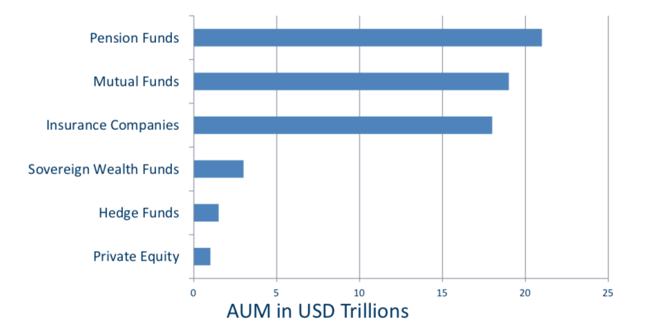 -->
</center>

---

# Institutions
## U.S. Institutional Holdings
<!-- Source: https://www.federalreserve.gov/releases/z1/20180920/z1.pdf -->
 
```{r, include=FALSE}
us_holdings <- read_csv("../Data/fof_data.csv")
```

```{r, echo=FALSE,   out.width='1600px' , fig.asp = .4}
xlabels <- c("Total Financial Assets",
             "Bond Holdings",
             "Equity Holdings")
ylabels <- c("Closed End Funds",
             "Life Insurance Companies",
             "Mutual Funds",
             "Private Pension Funds",
             "Property-Casualty Insurance",
             "Gov't Retirement Funds")
ggplot(data=us_holdings %>% 
         filter(variable %in% c( "total financial assets", "debt securities", "equities")) %>%
         mutate(variable = recode_factor(variable, "total financial assets"="Total Assets", 
                                         "debt securities"="Bonds", 
                                         "equities"="Equities")) %>%
         mutate(estimate = estimate/ 1000)) + 
  geom_col(aes(x=institution, y= estimate, fill=institution)) +
  coord_flip() +
  theme_minimal() +
  theme(text = element_text(size=18, 
                            family="News Cycle")) + 
  scale_fill_viridis_d(guide=FALSE) +
  scale_x_discrete(labels = ylabels) +
  ylab("Trillions of USD") +
  xlab("") + 
  facet_wrap(~variable)

```

---

# Institutions
## Mutual Funds

<div id= "left2">
* Also known as open-end funds
    + Investors pool and benefits from sharing information <br> collection and back‐office costs
* Fund issues new shares when investors buy in and redeems shares when investors cash out
* Priced at Net Asset Value (NAV):
</div>

<br>

$$ \frac{\text{Market Value of Assets} - \text{Liabilities}}{\text{Shares Outstanding}} $$


---

# Institutions
## Mutual Funds Fees

* Fee Structure: Four types
    1. Operating expenses (recurring)
    2. 12 b‐1 charge (recurring)
    3. Front‐end load (one time)
    4. Back‐end load (one time)
* Fees must be disclosed in the prospectus
* Share classes with different fee combinations

---

# Institutions
## Example of fees for various classes of mutual funds
<div class="column-left">
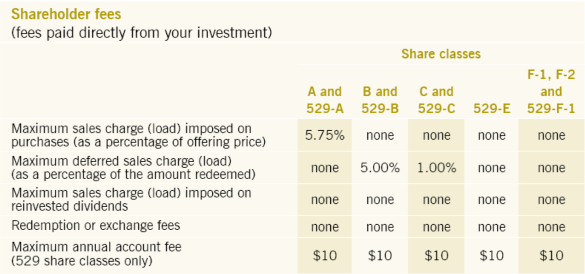
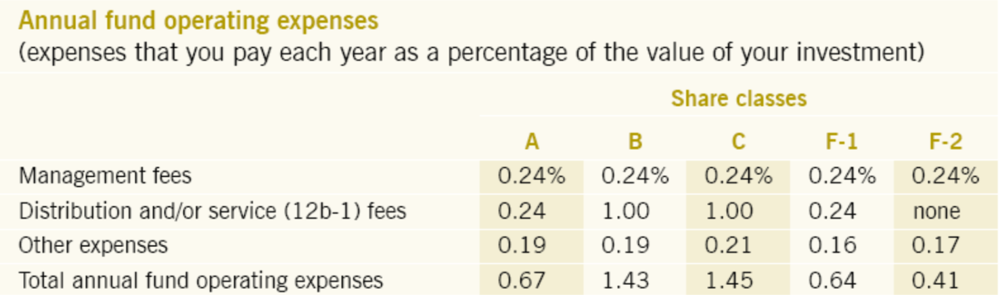
</div>

<div class="column-right">

* Compare the A, B and C shares
* What are the trade-offs between initial and deferred loads?
* Level of annual fees and expenses
</div>
---

## Mutual Funds - fees and incentives 

* People don't avoid high-fee index funds (Choi et al. 2010)

* Experimenters overfocused on returns since *fund inception*

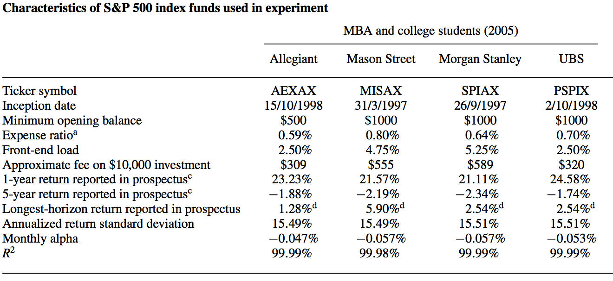


---

## Mutual Funds - fees and incentives 

Fund flow response distorts risk-taking incentives (Chevalier and Ellison (1997))

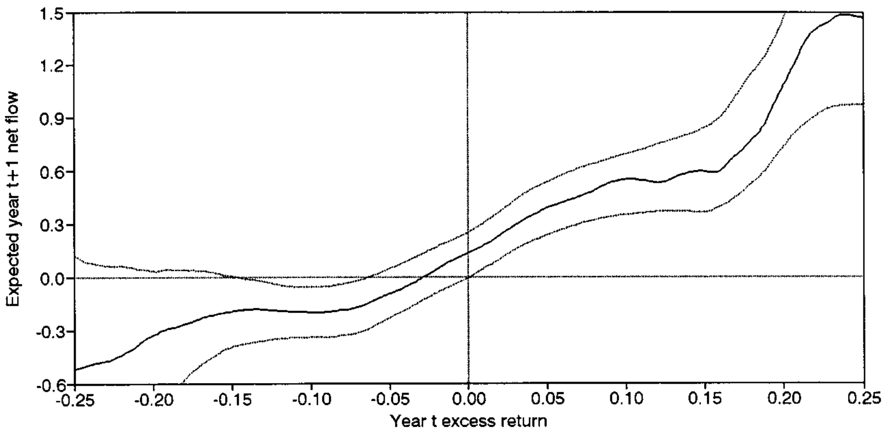

---

## Mutual Funds - costs over time

Mutual fund expense ratios have fallen over time, driven by several factors

1. Scale economies - assets under management have grown
2. Competition - investors pick funds with lower expense ratios
3. Increased presence of employer-sponsored retirement plans
    
```{r, include=FALSE}
mf_expenses <- read_csv("../Data/mutual_fund_expenses.csv")
library(viridis)
```

```{r, echo=FALSE,   out.width='1400px' , fig.asp = .4}
ggplot(data=mf_expenses %>% mutate(expenses = `expense ratios` * 100)) + 
  geom_col(aes(x=Year, y= expenses), fill = "#0f4d92") +
  geom_text(aes(label=expenses, x=Year, y=expenses+5)) +
  theme_minimal() +
  theme(text = element_text(size=18, 
                            family="News Cycle")) + 
  ylab("") +
  xlab("") 
```

<div style="text-align: right" color="black"><small>Source: [Investment Company Institute ](http://www.icifactbook.org)</small></div>


---

## Do mutual fund managers earn their fees?

<div class="fragment" data-fragment-index="1">
* How could we answer this?
</div>
<div class="fragment" data-fragment-index="2">
* One idea: how do mutual funds do compared to an index?
</div>
<div class="fragment" data-fragment-index="3">
* Performance of actively managed funds below the return on:
    + the Wilshire index in 23 of the 39 years from 1971 to 2009
    + the S&P index in 30 of the 47 years from 1970 to 2017

```{r, include=FALSE, cache=TRUE, echo=FALSE, message=FALSE}
library(lubridate)
mutualfunds <- read_csv("../Data/mutualfunds.csv", 
                        col_types = cols(caldt = col_date(format = "%m/%d/%Y"), 
                                         mret = col_double())) %>% 
  mutate(year = year(caldt))

avg_monthly_ret_mutuals <-  mutualfunds %>% group_by(caldt) %>% summarize(mean_ret = mean(mret, na.rm = TRUE))
sp500 <- read_csv("../Data/sp500.csv", col_types = cols(caldt = col_date(format = "%m/%d/%Y")))

mutual_fund_v_sp500 <- sp500 %>% right_join(avg_monthly_ret_mutuals) %>% 
  rename(sp500_ew = ewretd, sp500_vw = vwretd, mutualfund_ew = mean_ret) %>%
  select(-sp500_ew) %>% 
  mutate(sp500_vw = sp500_vw,
         mutualfund_ew= mutualfund_ew) %>%
  mutate(sp500_v_mf = sp500_vw - mutualfund_ew) %>%
  mutate( year = year(caldt)) %>%
  group_by(year) %>%
  summarize(mean_diff = mean(sp500_v_mf)) %>% 
  mutate(negative = case_when(mean_diff < 0 ~ TRUE,
                              TRUE ~ FALSE)) %>%
  filter(year != 2018)
mutual_fund_v_sp500_monthly <- sp500 %>% right_join(avg_monthly_ret_mutuals) %>% 
  rename(sp500_ew = ewretd, sp500_vw = vwretd, mutualfund_ew = mean_ret) %>%
  select(-sp500_ew) %>% 
  mutate(sp500_vw = sp500_vw,
         mutualfund_ew= mutualfund_ew) %>%
  mutate(sp500_v_mf = sp500_vw - mutualfund_ew) %>%
  group_by(caldt) %>%
  summarize(mean_diff = mean(sp500_v_mf)) %>% 
  mutate(negative = case_when(mean_diff < 0 ~ TRUE,
                              TRUE ~ FALSE)) 
  
```

```{r,  out.width='1600px' , fig.asp = .4,  message=FALSE}
ggplot(data = mutual_fund_v_sp500, aes(x = year, y = mean_diff)) + 
  geom_col(aes(fill = negative)) +
  theme_minimal() +
  theme(text = element_text(size=18, 
                            family="News Cycle")) + 
  ylab("") +
  xlab("") +
  scale_fill_viridis_d(guide=FALSE) +
  ggtitle("S&P 500 minus Mutual Fund Average")

```
</div>

---

<section data-background="../Pictures/andy_dwyer.gif">
</section>

---

# Institutions
## Mutual Funds - do fund managers earn their fees?

* Are all mutual fund managers like Andy Dwyer, or just the average?
* Malkiel (1995) evaluates 239 mutual funds with at least ten-year records
    + Compare each fund's performance to holding the S&P 500

<center>

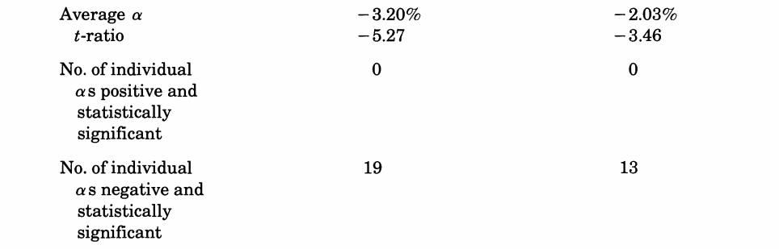
</center>

---

# Institutions
## Is there a "hot hand" for mutual fund managers?

<div class="fragment" data-fragment-index="1">
* Evidence for persistent performance is weak, but suggestive
* Malkiel (1995) tracks funds based on above/below median performance:


```{r, include=FALSE, cache=TRUE, echo=FALSE, message=FALSE}
malkiel_persistence <- read_csv("~/Dropbox/Teaching/MGT544Spring2019/Class Lectures/Data/malkiel_persistence.csv", 
                                col_types = cols(initial_year = col_integer()))
```

```{r,  out.width='1600px' , fig.asp = .4,  message=FALSE}
ggplot(data = malkiel_persistence, aes(y = repeat_winner_share, x =initial_year)) + 
  geom_col( fill = "#0f4d92") +
  theme_minimal() +
  theme(text = element_text(size=18, 
                            family="News Cycle")) + 
  ylab("") +
  geom_hline(yintercept=50) +
  xlab("") +
  scale_fill_viridis_d(guide=FALSE) +
  ggtitle("Share of 'winners' who repeat in subsequent year")
```
</div>

--- 

# Institutions
## Mutual Funds -- Persistence in performance?

* Bollen and Busse (2004) find tiny persistence at the quarterly level


```{r, include=FALSE, cache=TRUE, echo=FALSE, message=FALSE}
library(readxl)
bollen_busse_persistence <- read_excel("~/Dropbox/Teaching/MGT544Spring2019/Class Lectures/Data/bollen_busse_persistence.xlsx")
```

```{r,  out.width='1600px' , fig.asp = .4,  message=FALSE}
ggplot(data = bollen_busse_persistence, aes(y = alpha, x =decile, color=period)) + 
  geom_line(size=2) +
  theme_minimal() +
  theme(text = element_text(size=18, 
                            family="News Cycle")) + 
  ylab("") +
  geom_hline(yintercept=0) +
  scale_x_continuous(breaks=seq(1,10)) +
  xlab("Performance decile in ranking quarter") +
  scale_color_manual(values=c("#c90016", "#0f4d92")) +
  ggtitle("Risk-adjusted returns in subsequent quarter")
```


--- 

# Institutions
## Mutual Funds -- luck or skill?

Fama French “Luck vs Skill in Mutual Fund Returns” 2010

* Value weighted portfolio of active funds earns the market return, minus fees
* Distribution of “alpha” looks more consistent with luck than skill

<div class="column-left">
### Net Returns

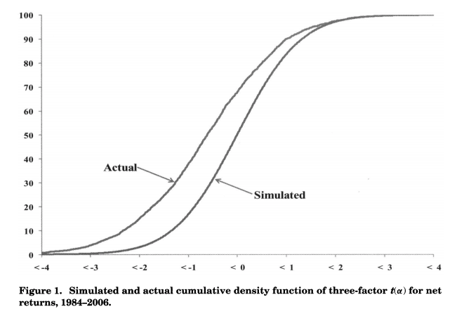
</div>

<div class="column-right">
### Gross Returns

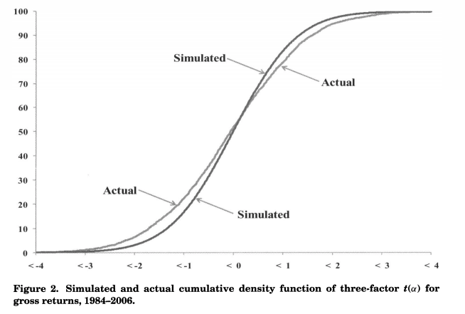
</div>
---

# Institutions
## Closed-End Funds

* Unlike mutual funds (open-end), no change in shares outstanding
* Old investors cash out by selling to new investors
* Managers unburdened with managing flows
* Traded continuously on exchanges
* Priced at premium or discount to NAV 
    - No easy arbitrage to close price gaps
* Hedge funds may ride discounts
    - Alternatively, may attempt to “open” funds

---

# Institutions
## What else? Other buyers/Other perspectives

* Pension funds
* Endowment Funds
* Alternative Asset Managers
    - to be discussed in the context of cases and guest lectures
* Next up...market structure

---

# Market Structure
## What kinds of markets are there?

1. Specialist Markets
2. Over-the-counter (OTC) markets
3. Electronic Communication Markets

---

# Market Structure
## What types of orders are there?

* Market order
    – Buy or sell order to be executed immediately at prevailing bid/ask price
* Limit order
    – Buy or sell order with a pre‐specified limit for the price

<center>
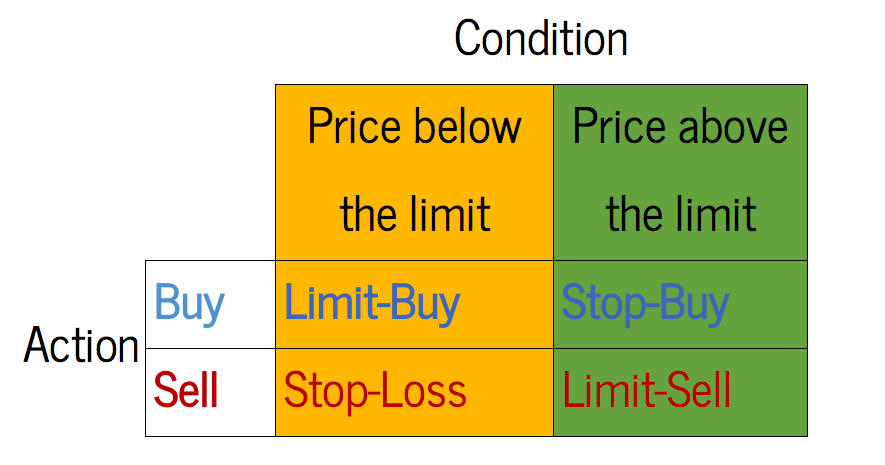
</center>

---

## Limit orders make up a limit order book

<center>
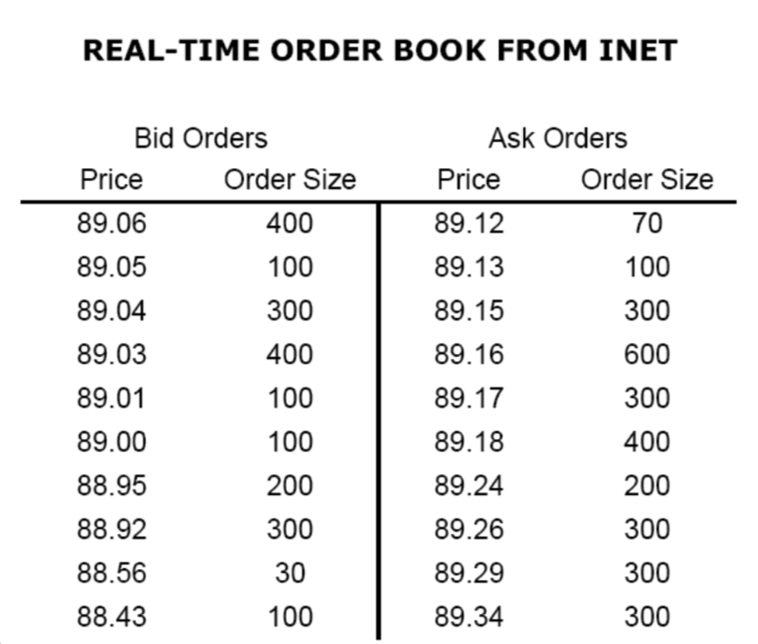
</center>

---

## Limit orders make up a limit order book

<center>
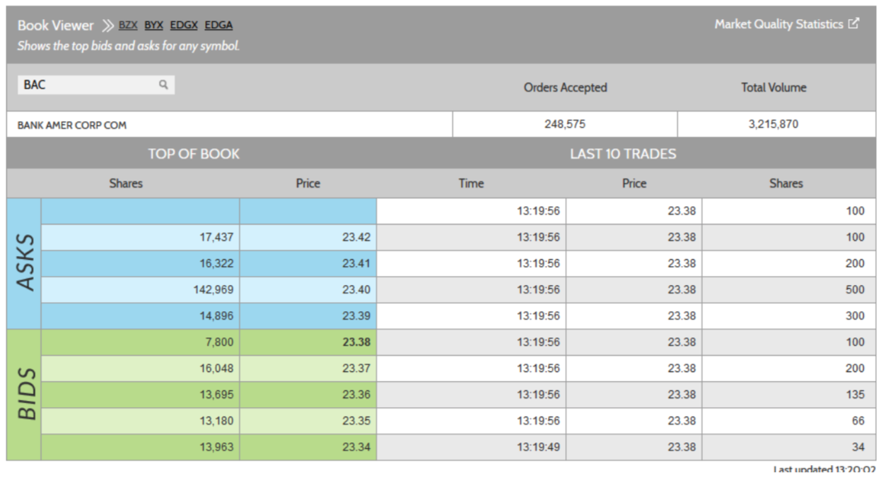
</center>


---

# Market Structure
## Types of Markets: Specialist Exchanges
<div class="column-left2">

* Example of a specialist exchange: NYSE
* Trading traditionally occurred through a combination of an auction (the order book) and a market maker (the specialist)
* Orders sent to exchange may be cleared electronically or sent to specialist
    - Only one specialist for each stock
    - Specialist may act as broker or as a dealer

</div>
  
---

# Market Structure
## Roles of specialists in specialist exchanges

* Broker
  - Matches buy and sell orders
  - Income generated by commissions

* Dealer
  - Specialists maintain their own bid and ask quotes and fill orders with own account if market spread too high
  - Historically, participated in about 25% of all transactions
  - Maintained price continuity


---

# Market Structure
##  Types of Markets: OTC Markets

* Trades negotiated dealer‐to‐dealer
* Nasdaq (National Association of Securities Dealers Automated Quotation system)
  - Originally, a price quotation system
  - Large orders may still be negotiated through brokers and dealers
  - Today, NASDAQ provides electronic trading (less OTC)
  
  

---

# Market Structure
##  Types of Markets: Electronic Communication Networks

<div class="column-left2">
* Private computer networks that directly link buyers with sellers for automated order execution
* To attract liquidity, networks may pay rebates to liquidity providers (market makers)
* Electronic clearing facilitates high frequency trading
  
</div>    

---

# Market Structure
## Electronic Communication Networks and high-frequency trading

<div class="column-left">
* Risks of high speed algorithmic trading include market disruption
* Flash Crash (2010)
  - On May 6, 2010, US indices fell by more than 5% in a matter of minutes, before rebounding almost as quickly
* Knight Capital (2012)
  - Flawed deployment of new trading program bankrupts major market maker 
  - Lost 440 million dollars from one programming mistake
</div>
<div class="column-right">
<center>
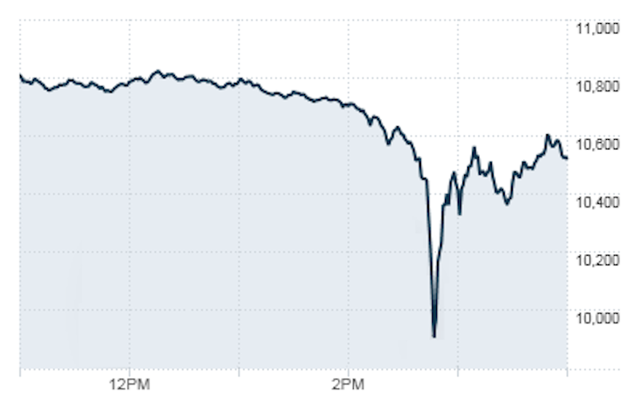
</center>
</div>
---

# Market Structure
## Electronic Communication Networks and flash crashes

<div class="column-left2">
SEC findings suggest the decline was triggered by a large automated sell order for S&P futures by a mutual fund

- Existing low volume due to high market uncertainty
- Sell order (75K contracts) was an automated algorithm that directed to sell 9% of prior minute’s trading volume
- HFTs responded to high volume of trades, but could not find fundamental buyers (SEC describes a game of “hot‐ potato”)
- High volume led to acceleration in sell order speed, which drove higher volatility and volume
</div>


---

# Market Structure
## Short-selling

* In our optimal portfolio, we’ll have the option to "short"–sell stocks that we don’t own
* Why would we?
    1. Stock may be overpriced (negative alpha)
    2. Stock may be appropriately priced, but we want to hedge out risk from a long position in a similar security (pairs trading)
* So what is it?
    
---

# Short-selling: you have to fight the witch

<center>
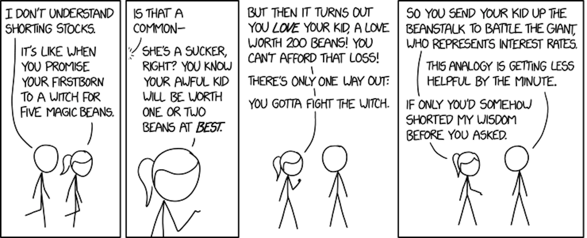
</center>

## (Not really)

---

# Market Structure
## Short-selling Mechanics

Suppose we have one dollar and believe stock A will underperform stock B.

* Buy $1 of stock B
* Borrow \$1 worth of stock A ( $1 \big/ P_A$ shares) and promptly sell the stock
    - Now, you owe the owner of A his shares back and will have to repurchase them in the market at tomorrow’s price
    - Proceeds from the sale serve as collateral to stock lender (e.g. \$1)
    - Reg T requires 50% additional collateral (above and beyond proceeds) be kept in account (shares of B will suffice) 

<br>
$$\text{Final Payoff} = 1 + (r_B ‐ r_A) + \ldots+ \underbrace{\text{short rebate}}_{\text{to be defined}}$$

What happens if stock goes down 10x? up 10x? 


<!--   -->

---

# Market Structure
## What is the short rebate?

* Short rebate is the interest I earn on my dollar of collateral sitting with the stock lender

$$ \text{Short Rebate} = r_{f} - \text{Security lending Fee} $$

* Securities lending fees vary greatly and reflect how easy the shares are to borrow (often less than 20 bps)
* In obvious shorting situations, short rebate will go negative (shares “hot or trading “special”) or can’t be found

---

# Market Structure
## Alternative ways to short stocks: *synthetic* shorts

Consider the following replicating strategy: 

* Buy a put and sell a call at the current strike price
    * Have the option to sell stock at current price 
    * Give someone else the option to buy the stock at today's price 
* What happens if real stock goes down 10x? up 10x? 
* However, options traded on less than half of publicly traded firms
* Moreover, options market behaves badly for “hot shares”
    - Put-call parity is violated by large amounts of short interest
    – E.g. 3com and Palm
    

---

# Market Structure
## Can the Market Add and Subtract? 3com/Palm Example 

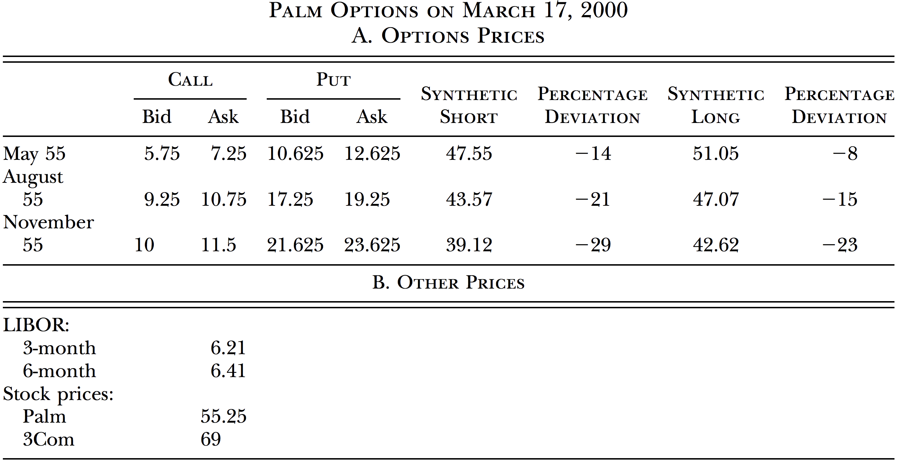 


    


