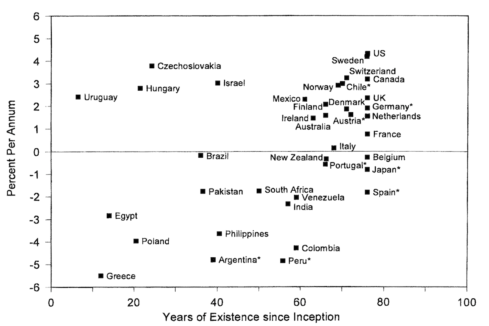

```{r setup, include=FALSE}
knitr::opts_chunk$set(echo = FALSE)
library(tidyverse)
library(tidyquant)
library(knitr)
library(kableExtra)
```

<style type="text/css">
  .reveal p {
    text-align: left;
  }
  .reveal ul {
    display: block;
  }
  .reveal ol {
    display: block;
  }
</style>

<section class=center>
## Lecture 2: Risk and Return
</section>

---

## Measuring Assets' Returns
```{r, include=FALSE, cache=TRUE, echo=FALSE, message=FALSE}
sp500 <- read_csv("../Data/sp500.csv", col_types = cols(caldt = col_date(format = "%m/%d/%Y"))) 
bonds <- read_csv("../Data/bonds.csv", col_types = cols(caldt = col_date(format = "%Y%m%d")))
returns <- sp500 %>% left_join(bonds) %>%  
  rename(sp500_vw = vwretd, bond = t30ret) %>% 
  gather(asset,return, -caldt) %>%
  mutate(asset = as.factor(asset)) %>%
  filter(is.na(return) == FALSE)

levels(returns$asset) <- c("30-day Treasury Bill", "S&P 500")
```
```{r, out.width='1600px' , fig.asp = .4,  message=FALSE}
ggplot(data = returns) +
  geom_line(aes(y = return, x = caldt), color = "#0f4d92") +
  theme_minimal() +  xlab("") +
  theme(text = element_text(size=18, 
                            family="News Cycle"),
        panel.spacing.y = unit(0, "lines"),
        plot.margin=unit(c(0,0,-6,0), "mm")) + 
  scale_fill_viridis_d(guide=FALSE) +
  ylab("Monthly Returns") +
  facet_wrap( asset~ ., scales = "free")
```

* Let’s begin by focusing on two major asset classes - stocks and bonds
* How have these assets performed historically? 
    - What's the best way to summarize their risk + return? 

---

## Measuring Assets' Returns

```{r, out.width='1600px' , fig.asp = .4,  message=FALSE}
ggplot(data = returns) +
  geom_histogram(aes(x = return), fill = "#0f4d92") +
  theme_minimal() +
  theme(text = element_text(size=18, 
                            family="News Cycle"),
        panel.spacing.y = unit(0, "lines")) + 
  scale_fill_viridis_d(guide=FALSE) +
  xlab("Monthly Returns") +
  ylab("") +
  facet_wrap( asset~ ., scales = "free")

```

* Why does a Treasury bill's return not fall below zero?
* Is monthly return the best measure? What else could we do?
    - Let's quickly refresh ourselves on how to measure returns.


---

## Return Definitions

* "Return" A.K.A. rate of return A.K.A. net return
<br>
$$
r_{t} = \frac{P_{t} + D_{t}}{P_{t-1}} - 1
$$
* Gross returns (sometimes $R_{t}$) referred to as $1+r_{t}$
* The risk-free rate will be called $r_{f}$
    - How can I get the risk-free rate?
* **Excess returns** above the risk free rate are $r_{e} = r - r_{f}$


---

## Return Defintions

A holding-period return of $T$ years is 

$$
  r_{0,T} = (1+r_{1})(1+r_{2})\ldots (1+r_{T}) - 1
$$

* How you measure the holding period matters a ton!
* Recall the mutual fund experiment

```{r, out.width='1600px' , fig.asp = .4,  message=FALSE,warning=FALSE}
cumulative_returns <- returns %>% filter(asset == "S&P 500") %>%
  mutate(logr = log(return+1)) %>% 
  tq_mutate(select = logr,
            mutate_fun = rollapply,
            width = 60,
            FUN = sum,
            na.rm = TRUE,
            col_rename = "annual_cum") %>%
  mutate(annual_cum = exp(annual_cum) - 1) %>%
  mutate(caldt = caldt - years(5))

ggplot(data = cumulative_returns %>% filter(is.na(annual_cum) == FALSE )) +
  geom_line(aes(y = annual_cum, x = caldt),  color = "#0f4d92") +
  theme_minimal() +
  theme(text = element_text(size=18, 
                            family="News Cycle")) + 
  scale_x_date() +
  ylab("") +
  xlab("") +
  geom_hline(yintercept=0) +
  ggtitle("Forward five-year cumulative returns on the S&P 500")
  
  
  
```

---

## Return Definitions

* How do we compare returns across different horizons?
    + Say I want to compare a window of cumulative returns 5 v 10 years.

<div class="fragment" data-fragment-index="1">
* Annualized returns on the cumulative return:
$$
\widetilde{r}_{0,T} = (1+r_{0,T})^{\frac{1}{T_{\text{years}}}} - 1
$$


```{r, include=FALSE, cache=TRUE, echo=FALSE, message=FALSE}
cumulative_returns <- returns %>% filter(asset == "S&P 500") %>%
  mutate(logr = log(return+1)) %>% 
  tq_mutate(select = logr,
            mutate_fun = rollapply,
            width = 60,
            FUN = mean,
            na.rm = TRUE,
            col_rename = "annual_cum5") %>%
  tq_mutate(select = logr,
            mutate_fun = rollapply,
            width = 48,
            FUN = mean,
            na.rm = TRUE,
            col_rename = "annual_cum4") %>%
  tq_mutate(select = logr,
            mutate_fun = rollapply,
            width = 36,
            FUN = mean,
            na.rm = TRUE,
            col_rename = "annual_cum3") %>%
  tq_mutate(select = logr,
            mutate_fun = rollapply,
            width = 24,
            FUN = mean,
            na.rm = TRUE,
            col_rename = "annual_cum2") %>%
  tq_mutate(select = logr,
            mutate_fun = rollapply,
            width = 12,
            FUN = mean,
            na.rm = TRUE,
            col_rename = "annual_cum1") %>%
  mutate(annual_cum5 = exp(annual_cum5*12) -1,
         annual_cum4 = exp(annual_cum4*12) -1,
         annual_cum3 = exp(annual_cum3*12) -1,
         annual_cum2 = exp(annual_cum2*12) -1,
         annual_cum1 = exp(annual_cum1*12) -1) %>%
  select(starts_with("annual_cum"), caldt) %>%
  gather(horizon, return, -caldt) %>%
  mutate(horizon = factor(horizon))
levels(cumulative_returns$horizon) <- c("1 Year", "2 Year", "3 Year", "4 Year", "5 Year")

```

```{r, out.width='1600px' , fig.asp = .4,  message=FALSE,warning=FALSE}
ggplot(data = cumulative_returns %>% filter(is.na(return) == FALSE )) +
  geom_line(aes(y = return, x = caldt, color=horizon)) +
  theme_minimal() +
  theme(text = element_text(size=18, 
                            family="News Cycle")) + 
  scale_x_date() +
  ylab("") +
  xlab("") +
  geom_hline(yintercept=0) +
  ggtitle("Historical annualized cumulative returns at diferent horizons") +
  scale_color_viridis_d()
  
  
```

</div>

---

## Return Definitions

* Arithmetic average returns
$$
\overline{r} = \frac{1}{T}(r_{1} + r_{2} + \ldots + r_{T})
$$
* Geometric average returns
$$
r_{G} = \left[(1+r_{1})(1+r_{1})\ldots (1+r_{T})\right]^{\frac{1}{T}} - 1 = \big[\frac{P_{T}}{P_{0}}\big]^{\frac{1}{T}} - 1
$$
    - Arithmetic average is unbiased estimate of 1-period future returns *(expected returns)*
    - Geometric average is a measure of cumulative past performance

---

## Return Definitions

* We calculate estimates of variance using squared deviations from arithmetic average returns
$$
\sigma^{2}(r) = VAR(r) = \frac{1}{T}\bigg((r_{1}-\overline{r})^{2} + (r_{2}-\overline{r})^{2} + \ldots + (r_{T}-\overline{r})^{2})\bigg)
$$
* Standard deviation is the square-root of variance:
$$
\sigma(r) = SD(r) = \sqrt{\frac{1}{T}\bigg((r_{1}-\overline{r})^{2} + (r_{2}-\overline{r})^{2} + \ldots + (r_{T}-\overline{r})^{2})\bigg)}
$$

---

## Return Defintions

* Finally, **covariance** measures how two returns move together
$$
\begin{aligned}
\sigma_{i,j} = COV(r_{i}, r_{j}) = \frac{1}{T}\bigg((r_{1,i}-\overline{r}_{i})(r_{1,j}-\overline{r}_{j}) &+ (r_{2,i}-\overline{r}_{i})(r_{2,j}-\overline{r}_{j})\\
&+ \ldots + (r_{T,i}-\overline{r}_{i})(r_{T,j}-\overline{r}_{j})\bigg)
\end{aligned}
$$
* Correlations scale the covariance by standard deviations
$$
\rho_{i,j} = \frac{\sigma_{i,j}}{\sigma_{i}\sigma_{j}}
$$
* Excel provides functions AVERAGE,GEOMEAN,VAR, STDEV, and COVAR

---

## Wanted: Information about risk and return

* To make investment decisions, we need to know
    - ... the expected **future** returns
    - ... the riskiness of **future** returns
* We turn to historical return data for these 
    - A caveat...
    - The data give a pretty good sense of the risk, but expected returns are hard to measure.
    - Why? 
    

<!-- ```{r, include=FALSE, cache=TRUE, echo=FALSE, message=FALSE} -->
<!-- annualized_monthly_returns <- returns %>% filter(asset == "S&P 500") %>% -->
<!--   mutate(annual_ret = ((1+return)^(12) -1)) -->
<!-- ``` -->

<!-- ```{r, out.width='1600px' , fig.asp = .4,  message=FALSE,warning=FALSE} -->
<!-- ggplot(data = annualized_monthly_returns) + -->
<!--   geom_histogram(aes(x = annual_ret)) -->
<!-- ``` -->

---

## Asset Returns: Historical Record
## United States

* Siegel (1992) provides average real return data for the U.S. since 1802:

```{r}

periods <- c("1802-1990", "1802-1870", "1871-1925", "1925-1990", "1990-")
stock_arith_avg <- c(7.8, 6.9,7.9, 8.6, 9.03)
stock_arith_sd<- c(18.4, 16.6,16.6, 21.2, 18.78)
stock_geom_avg <- c(6.2, 5.7,6.6, 6.4, 7.30)
bond_arith_avg <- c(3.1, 5.4, 3.3,0.6,0.40)
bond_arith_sd <- c(6.2, 7.6, 4.8,4.3,2.12)
bond_arith_geom <- c(2.9, 5.1, 3.1, 0.5, 0.38)


siegel_data <- tibble(Period = periods, stock_arith_avg, stock_arith_sd, stock_geom_avg, 
                      bond_arith_avg, bond_arith_sd, bond_arith_geom)
options("kableExtra.html.bsTable" = T)
kable(
  head(siegel_data, 5), booktabs = TRUE,
  col.names = c("Period",
                "Arithmetic Mean",
                "Arithmetic SD",
                "Geometric Mean",
                "Arithmetic Mean",
                "Arithmetic SD",
                "Geometric Mean"),
  caption = 'Historical Returns from Siegel (1992)'
) %>%
  kable_styling(bootstrap_options = c("striped", "condensed")) %>%
  kableExtra::add_header_above(c(" " = 1, "Stocks" = 3, "Bonds" = 3))
```

* Historic variation in risk premium (stocks minus bonds) 
* Stock returns are remarkably strong. Is US an outlier?

---

## Asset Returns: Historical Record

```{r, include=FALSE, cache=TRUE, echo=FALSE, message=FALSE}

cross_county_returns <- read_csv("~/Dropbox/Teaching/MGT544Spring2019/Class Lectures/Data/cross_county_returns.csv") %>% gather(type, return, -country)
```

```{r, out.width='1600px' , fig.asp = .4,  message=FALSE,warning=FALSE}
ggplot(data = cross_county_returns) +
  geom_bar(aes(y = return, 
               x=fct_reorder2(factor(country), type, return, function(x, y) {sum(y[x == "real"])}),
               fill=type),
           stat = "identity",
           position=position_dodge2()) +
  theme_minimal() +
  theme(text = element_text(size=18, 
                            family="News Cycle")) + 
  ylab("") +
  xlab("") +
   geom_hline(yintercept=5.1) +
  coord_flip() +
  scale_fill_manual(guide=FALSE, values = c("#c90016", "#0f4d92")) +
  ggtitle("Average Cross Country Equity Returns from 1900-2000") 
  
  
```

* US returns high, but not an outlier

---

## Asset Returns: Historical Record

```{r, include=FALSE, cache=TRUE, echo=FALSE, message=FALSE}

cross_county_sd <- read_csv("~/Dropbox/Teaching/MGT544Spring2019/Class Lectures/Data/cross_county_sd.csv") %>% gather(type, sd, -country)
```

```{r, out.width='1600px' , fig.asp = .4,  message=FALSE,warning=FALSE}
ggplot(data = cross_county_sd) +
  geom_bar(aes(y = sd, 
               x=fct_reorder2(factor(country), type, sd, 
                              function(x, y) {sum(y[x == "equity"])}),
               fill=type),
           stat = "identity",
           position=position_dodge2(width=0.4)) +
  theme_minimal() +
  theme(text = element_text(size=18, 
                            family="News Cycle")) + 
  ylab("") +
  xlab("") +
   geom_hline(yintercept=23) +
  coord_flip() +
  scale_fill_manual(guide=FALSE, values = c("#c90016", "#0f4d92")) +
  ggtitle("Standard Deviation of Cross Country Equity Returns")
  
  
```

* Average s.d. of returns is 23% (US 20%)
* What's up with Italy, Germany, Japan?

---

## High returns or survivorship bias?

<div id="left2">
<center>

</center>
</div>

<div id = "right">
* Countries with low returns fall out of the analysis (Jorion and Goetzmann (1999)). 

* Median real return of all other countries is 0.75% (compared to 4.3% for US).
</div>

---

## Still waiting for data?

<div id="left2">
Most recent U.S. historical data suggest:

* Average excess returns of large stocks over long term bonds ($r_{e}$) of roughly 6% ... with a standard deviation of 20% ($\sigma_{e}$)
* With 81 years of data, **standard error** associated with mean excess returns is
$$
\sigma(\overline{r}_{e}) = \frac{\sigma(r_{e})}{\sqrt{T}} = \frac{20 \%}{9} \approx 2.2\%
$$
* Can we reject the null hypothesis that excess returns are 4%... or 2%?

</div>

---

## How can we forecast returns going forward?

Recall that

$$
r_{1} = \underbrace{\frac{D_{1}}{P_{0}}}_{\text{dividend yield}} + \underbrace{\frac{P_{1}}{P_{0}}}_{\text{growth}}
$$

Also,

$$
\underbrace{\frac{D_{1}}{P_{0}}}_{\text{dividend yield}}  = \text{earnings payout share} \times \frac{E_{1}}{P_{0}}
$$
where,
$E_{1}$ is earnings. 

This implies 
$$
r_{1} = \text{firm's payout share} \times \frac{E_{1}}{P_{0}} + \text{growth}
$$

---

## The Gordon Model 

$$
r_{1} = \text{payout share} \times \frac{E_{1}}{P_{0}} + \text{growth}
$$

* Historically, payout has been around 50\%, P/E about 25 and growth rate of about 4-5% (nominal)
    - What does that imply about nominal expected returns? 
    
<div class="fragment" data-fragment-index="1">    
* Estimate is about 6-7% nominal expected return for stocks, or 4% real, or a risk premium of 2-3% over nominal bonds
* This is very low versus history
* To believe anything else, you must disagree with payout, E/P, or growth. 
</div>

---

## Shiller Price-Earnings Ratios

```{r, include=FALSE, cache=TRUE, echo=FALSE, message=FALSE}

shiller_pe <- read_csv("~/Dropbox/Teaching/MGT544Spring2019/Class Lectures/Data/shiller_pe.csv", 
                       col_types = cols(Date = col_date(format = "%m/%d/%Y"))) %>%
  mutate(year = year(Date)) 

annualized_ret <- cumulative_returns  %>% filter(horizon == "5 Year") %>%
  mutate(year = year(caldt)) %>%
  group_by(year) %>%
  summarize(return = mean(return, na.rm=TRUE)) %>%
  mutate(year = year -5) %>%
  right_join(shiller_pe) %>%
  filter(year > 1925 & year < 2019)

library(ggrepel)
```

```{r, out.width='1600px' , fig.asp = .4,  message=FALSE,warning=FALSE}

ggplot(data = annualized_ret, aes(y = return, x = Value)) +
  geom_point(label=year) +
  geom_smooth(method='lm', se=FALSE) +
  theme_minimal() +
  theme(text = element_text(size=18, 
                            family="News Cycle")) + 
  ylab("") +
  xlab("Shiller P/E") +
  ggtitle("Predictive power of P/E  on forward five year annualized return")

```

---

## Shiller Price-Earnings Ratios

```{r, out.width='1600px' , fig.asp = .4,  message=FALSE,warning=FALSE}

labelled_text <- annualized_ret %>% filter(year %in% c(2000, 2018, 1929)) 
ggplot(data = annualized_ret, aes(x = year, y = Value)) +
  geom_line() +
  geom_text(aes(x=labelled_text$year[1], 
                y = labelled_text$Value[1] + 5, 
                label = labelled_text$Value[1])) +
  geom_text(aes(x=labelled_text$year[2], 
                y = labelled_text$Value[2] + 5, 
                label = labelled_text$Value[2])) +
  geom_text(aes(x=labelled_text$year[3], 
                y = labelled_text$Value[3] + 5, 
                label = labelled_text$Value[3])) +  
  theme_minimal() +
  theme(text = element_text(size=18, 
                            family="News Cycle")) + 
  ylab("") +
  xlab("") +
  ggtitle("Shiller P/E over time")

```

---

## Takeaways

* We still have a limited amount of high quality data to make inferences from, but...
* Historical data suggests a premium for risk in asset returns, but the size of the premium is up for debate
* If expected returns for the **aggregate stock market** with 80+ years of data are so imprecise, what are we to do with individual stocks?
* Need more than data to understand expected returns

---

## Postscript: other risk measures

Value at Risk (VaR)

* A measure of loss most frequently associated with extreme negative returns
* VaR is the quantile of a distribution below which lies q % of the possible values of that distribution
* The 5% VaR, commonly estimated in practice, tells us how bad returns (or losses) will be in the worst 5% of times


---

## VaR under normality

* 5% VaR return is equal to E(r) - 1.645 X s.d.
    - 5% Value at Risk (VaR) represents the lower bound on the return’s 10% confidence interval
* Under non-normality, look at historic returns for 5% cutoff


```{r, out.width='1600px' , fig.asp = .4,  message=FALSE}
annualized_monthly_returns <- returns %>% filter(asset == "S&P 500") %>%
  mutate(return = (return+1)^12 -1) %>% filter(return < 4)

q <- quantile(annualized_ret$return, na.rm = TRUE, probs = c(0.1, 0.5, 1, 2, 5, 10, 50)/100)

ggplot(data = annualized_ret %>% filter(!is.na(return)))  +
  geom_histogram(aes(x = return), binwidth=0.005, fill = "#0f4d92") +
  theme_minimal() +
  theme(text = element_text(size=18, 
                            family="News Cycle"),
        panel.spacing.y = unit(0, "lines")) + 
  geom_vline(xintercept = q[5]) + 
  geom_text(aes(x = q[5]+ .015, y = 5, label = round(q[5], digits=3))) + 
  scale_fill_viridis_d(guide=FALSE) +
  xlab("Annual Returns") +
  ylab("") 
```

---

## Expected Shortfall (ES)

* Also called conditional tail expectation (CTE)
* More conservative measure of downside risk than VaR
    - VaR takes the highest return from the worst cases
    - ES takes an average return of the worst cases


```{r, out.width='1600px' , fig.asp = .4,  message=FALSE}
annualized_monthly_returns <- returns %>% filter(asset == "S&P 500") %>%
  mutate(return = (return+1)^12 -1) %>% filter(return < 4)

q <- quantile(annualized_ret$return, na.rm = TRUE, probs = c(0.1, 0.5, 1, 2, 5, 10, 50)/100)
es <- annualized_ret %>% filter(return <= q[5]) %>% 
  summarize(es = mean(return, na.rm = TRUE))
ggplot(data = annualized_ret %>% filter(!is.na(return)))  +
  geom_histogram(aes(x = return), binwidth=0.005, fill = "#0f4d92") +
  theme_minimal() +
  theme(text = element_text(size=18, 
                            family="News Cycle"),
        panel.spacing.y = unit(0, "lines")) + 
  geom_vline(xintercept = q[5]) + 
  geom_text(aes(x = q[5]+ .015, y = 5, label = round(q[5], digits=3))) + 
  geom_vline(xintercept = es$es[1]) + 
  geom_text(aes(x = es$es[1]+ .015, y = 5, label = round(es$es[1], digits=3))) +   
  scale_fill_viridis_d(guide=FALSE) +
  xlab("Annual Returns") +
  ylab("") 
```


